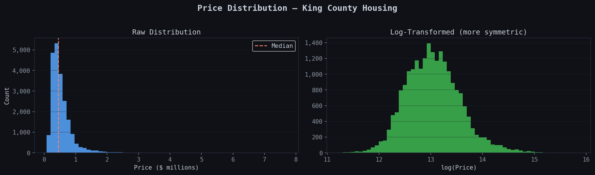
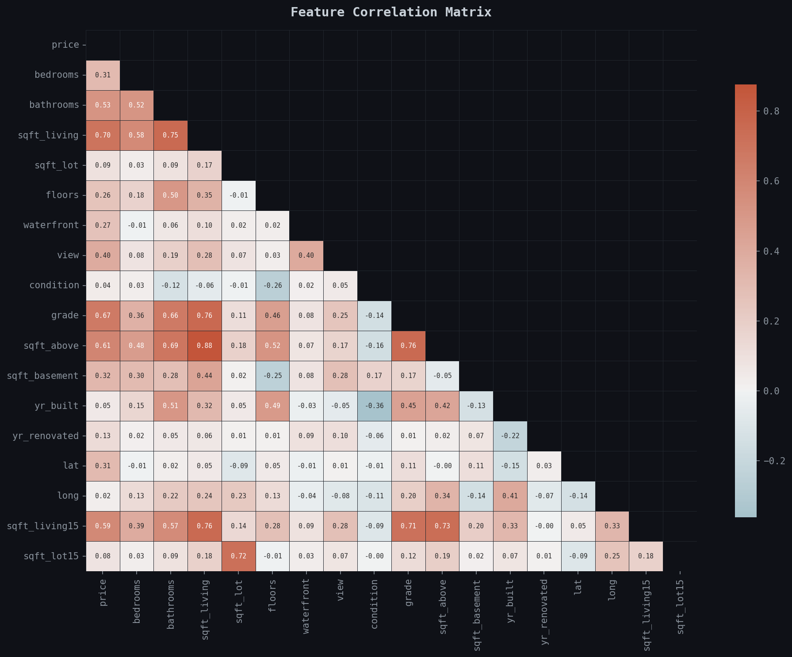
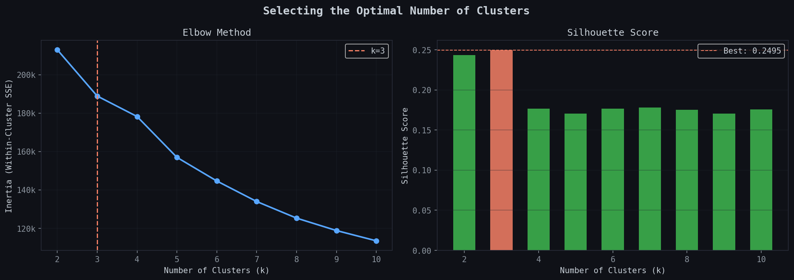
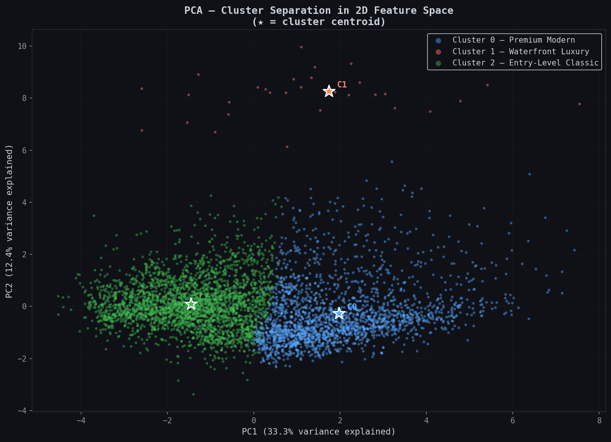
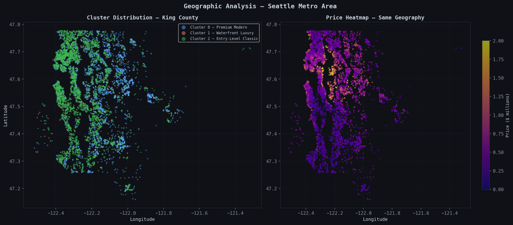
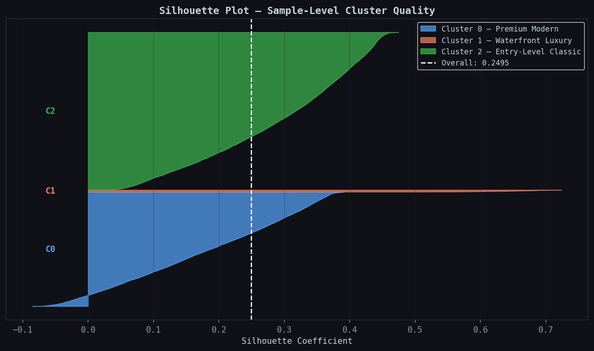

# KC-House-Clustering
K-Means clustering analysis of 21,613 Seattle housing sales to identify distinct real estate market segments.

# 🏠 Seattle Real Estate Market Segmentation

K-Means clustering analysis of 21,613 residential property sales in King County, WA (2014–2015), segmenting the housing market into structurally distinct groups using unsupervised machine learning.

## 📸 Preview

**Price Distribution**


**Feature Correlation Matrix**


**Optimal Number of Clusters**


**PCA 2D Projection**


**Geographic Distribution**


**Silhouette Analysis**


## 🚀 Features

- Loads and cleans 21,613 housing records from King County
- Removes extreme outliers using 1st–99th percentile on `sqft_living`
- Selects 13 semantically meaningful features for clustering
- Determines optimal k using **Elbow Method** and **Silhouette Score**
- Trains K-Means with optimal k and generates automatic cluster insights
- Visualizations saved as PNG:
  - Price distribution (raw and log-transformed)
  - Feature correlation heatmap
  - Elbow and Silhouette plots
  - Cluster centroids heatmap
  - Price boxplot by cluster
  - PCA 2D projection with centroids
  - Geographic distribution map + price heatmap
  - Silhouette plot (sample-level quality)

## 🛠️ Built With

- **Python 3**
- **pandas & NumPy** — data loading and manipulation
- **scikit-learn** — KMeans, StandardScaler, PCA, silhouette metrics
- **Matplotlib & Seaborn** — visualizations

## 📊 Market Segments Identified

| Segment | Size | Avg Price | Key Profile |
|---------|------|-----------|-------------|
| **Cluster 0 — Premium Modern** | 8,849 homes (41%) | $660K | Large modern builds, high grade, suburban sprawl |
| **Cluster 1 — Waterfront Luxury** | 143 homes (0.7%) | $1.43M | 100% waterfront, top view scores, premium pricing |
| **Cluster 2 — Entry-Level Classic** | 12,203 homes (57%) | $420K | Smaller, older, lower grade, inland locations |

## 🔑 Key Findings

- The market is structurally bimodal — 57% affordable entry-level, 41% premium modern
- Waterfront drives extreme value — Cluster 1 commands prices 3.4× higher than entry-level despite being only 0.7% of the market
- Grade and sqft_living are the strongest clustering signals
- Clusters show clear spatial separation across the county

## ▶️ How to Run

1. Clone the repository:
   ```bash
   git clone https://github.com/VelosoMiguel/kc-house-clustering.git
   cd kc-house-clustering
   ```

2. Install dependencies:
   ```bash
   pip install pandas numpy scikit-learn matplotlib seaborn
   ```

3. Download the dataset from [Kaggle — House Sales in King County](https://www.kaggle.com/datasets/harlfoxem/housesalesprediction) and place `kc_house_data.csv` in the project folder.

4. Run the script:
   ```bash
   python kc_house_clustering.py
   ```

The script automatically saves all visualizations as PNG files in the project folder.

## 🔮 Future Improvements

- [ ] DBSCAN or Gaussian Mixture Models for non-spherical clusters
- [ ] Add school district ratings, commute times, and crime data
- [ ] Use cluster labels as features in a supervised price prediction model (XGBoost)
- [ ] Time-series analysis of seasonal segment shifts

## 👤 Author

**Miguel Veloso**  
[GitHub](https://github.com/VelosoMiguel) · [LinkedIn](https://www.linkedin.com/in/miguel-veloso-91355b372/)
